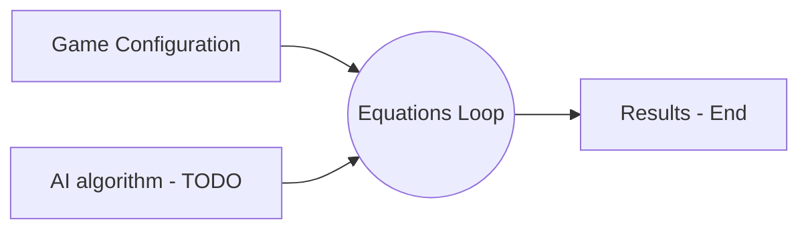

# Welcome to MathPath!

MathPath is simple math equation generating Android application made for elementary school students. Math solving was was never simpler and more entertaining.

# About application

MathPath is fully offline application developed with "Keep it simple" methodology. No registration or any complications are needed to start solving the task. On the start screen you can only change game configurations. When you hit the "start" button, you are proceeded to solving screen where you need to input right number to solve the given equation. At the end, the results screen is displayed.

# Technical stuff

MathPath is developed in Kotlin. SQLite with anko-sqlite library is used for backend (local) and MVEL library is used for equation strings evaluation.

# Todo

* Progressbar with red or green step color depending on right or wrong answer
* AI algorithm that will generate or repeat tasks based on former user solutions
* More game options like parentheses and random input field placing (currently it is only behind = character)
* Visual changes (game icon, in-game icons like graph chart, child friendly graphs and fonts)
* Better UX:
	* some kind of in-game awarding to keep users active
	* more useful statistics like solving stats by operators
	* achievements like 7 active days in row

# Application flow chart

If you have any remarks or suggestions to improve the app, please feel free to contact me at brabec.tomislav@gmail.com
